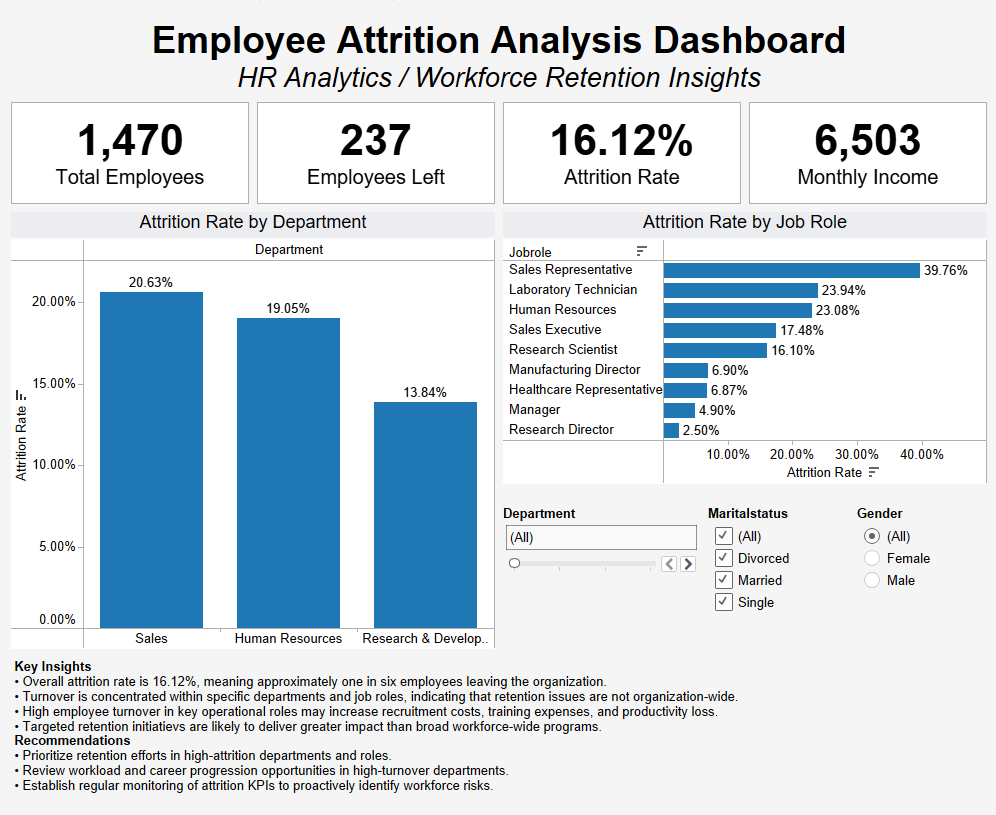
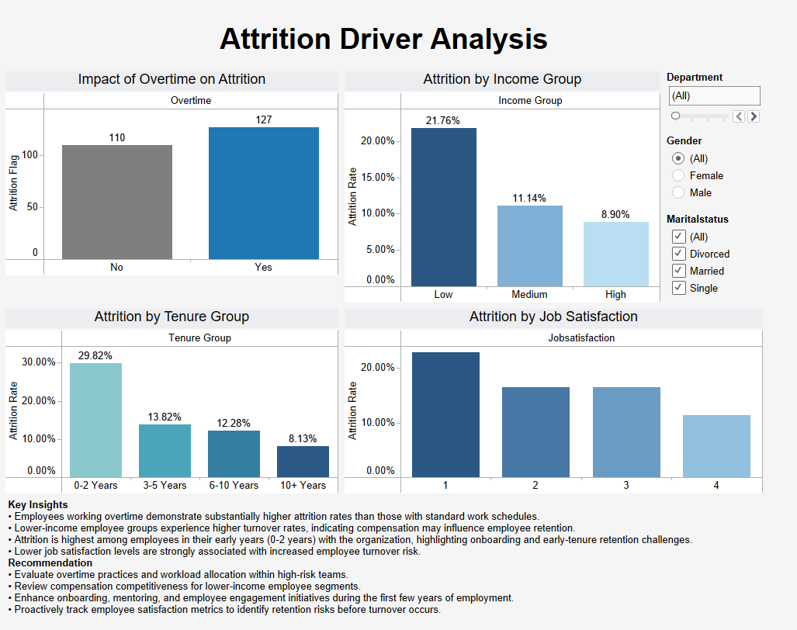

# Employee Attrition Analysis | SQL & Tableau

## 1. Project Overview

Employee turnover can significantly impact organisational performance through increased recruitment costs, reduced productivity, and loss of institutional knowledge. This project analysis workforce data to identify employee attrition patterns, uncover key drivers of turnover, and provide  actionable recommendations to improve retention and workforce planning.

Using SQL for data analysis and Tableau for visualisation, the project explores how factors such as department, job role, compensation, overtime, tenure and job satisfaction influence employee attrition.

## 2. Business Objective

The Human Resources team seeks to better understand workforce attrition and identify employee segments at higher risk of leaving the organisation.

The objectives of this analysis were to:

- Measure overall employee attrition.
- Identify departments and job roles with elevated turnover.
- Evaluate the impact of compensation, overtime, tenure, and job satisfaction on employee retention.
- Develop interactive dashboards to support workforce planning and decision-making.
- Provide data-driven recommendations to reduce employee turnover.

## 3. Tools & Technologies

- PostgreSQL
- SQL
- Tableau Desktop
- Microsoft Excel

## 4. Dataset

Dataset: IBM HR Analytics Employee Attrition Dataset (Kaggle)

The dataset contains workforce information for 1,470 employees, including demographic, compensation, job-related, and satisfaction-related attributes.

Key fields analysed include:

- Employee Attrition
- Department
- Job Role
- Monthly Income
- Overtime
- Years at Company
- Job Satisfaction
- Marital Status
- Gender

## 5. Data Preparation

The dataset was imported into PostgreSQL and organised within a dedicated HR schema for analysis.

Data preparation activities included:

- Creating a structured database table for employee records.
- Validating data integrity and record counts.
- Reviewing column data types and attribute consistency.
- Creating employee segmentation groups for analysis.
- Preparing data for KPI reporting and dashboard development.

Derived business categories included:
- Income Groups
- Tenure Groups
- Attrition Indicators

## 6. SQL Analysis

SQL was used to validate the dataset, calculate workforce KPIs, and perform employee attrition analysis.

Key analysis included:

**Data Validation**

- Table structure confirmation
- Record count verification
- Row count verification
- Data quality checks
- Data distribution sanity checks
- Data range validation

**Workforce KPIs**

- Total Employees
- Employees Left
- Attrition Rate
- Average Monthly Income

**Attrition Analysis**

- Attrition Rate by Department
- Attrition Rate by Job Role
- Attrition Rate by Overtime Status
- Attrition Rate by Income Group
- Attrition Rate by Tenure Group
- Attrition Rate by Job Satisfaction

All SQL queries used in this project are available in the `/sql` folder.

## 7. Dashboard Overview

**Dashboard 1: Executive Attrition Overview**

Provides a high-level summary of workforce turnover through:

- Workforce KPI cards
- Department-level attrition analysis
- Job role attrition analysis
- Executive insights and recommendations
- Interactive employee segmentation filters

**Dashboard 2: Attrition Driver Analysis**

Explores factors contributing to employee turnover through:

- Overtime analysis
- Compensation analysis
- Tenure analysis
- Job satisfaction analysis
- Interactive employee segmentation filters

### Dashboard Screenshots

#### Executive Attrition Overview

#### Attrition Driver Analysis

## 8. Key Findings

- Employee attrition remains a significant workforce challenge, with approximately one in six employees leaving the organisation.
- Attrition is concentrated within specific departments and job roles rather than being evenly distributed across the workforce.
- Employees working overtime experience substantially higher attrition rates compared to employees with standard work schedules.
- Lower-income employee groups demonstrate higher turnover rates than higher-income employees.
- Employees within their first few years (0-2 years) of employment exhibit the highest attrition levels.
- Lower job satisfaction scores are associated with increased employee turnover risk.

## 9. Business Recommendations

- Prioritize retention initiatives within departments and job roles experiencing elevated turnover.
- Review overtime practices and workload allocation in high-risk employee groups.
- Strengthen onboarding and mentoring programs for early-tenure employees.
- Assess compensation competitiveness for employee groups with higher attrition rates.
- Monitor employee satisfaction metrics proactively to identify retention risks before turnover occurs.

## 10. Skills Demonstrated

**Technical Skills**

- SQL Querying
- PostgreSQL
- Tableau Dashboard Development
- Data Validation
- Data Cleaning
- KPI Development
- Data Visualization

**Analytical Skills**

- Workforce Analytics
- Employee Segmentation
- Attrition Analysis
- Root Cause Analysis
- Business Problem Solving

**Business Skills**

- Stakeholder-Focused Reporting
- Insight Generation
- Executive Dashboard Design
- Data-Driven Decision Making

## 11. Project Outcomes

This project demonstrates the end-to-end analytics workflow, from data preparation and SQL-based analysis to dashboard development and business recommendations.

The analysis successfully identified workforce segments with elevated attrition risk and provided actionable insights that can support employee retention strategies, workforce planning initiatives, and HR decision-making.

Through this project, SQL and Tableau were leveraged to transform employee data into meaningful business insights and executive-level reporting.

